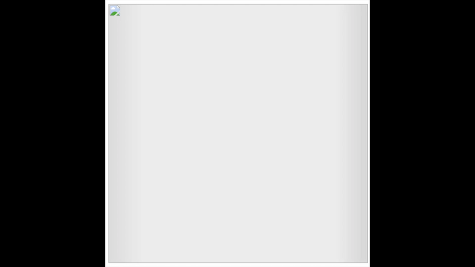

# Blurry Image Load

## Synopsis

A lightweight, zero-dependency library that loads images on demand. Until the images are loaded, a very small version of each image is displayed with a blur filter over it. Inspired by Medium's progressive image loading of a similar style. Below is an example:


If the user's browser doesn't support CSS filters, a blank, gray shimmer is shown until the full-sized image loads. Below is an example:



[Click here to see a live demo](https://dombrant.github.io/blurry-image-load/)

## Installation

Download the `blurry-load.css` and `blurry-load.js` files (found in the `src` folder) and include them in your project.

**NOTE:** If you do not want to see a flash of the tiny, pixelated image in browsers that do not support CSS filters, link to the JavaScript file in the `head` tag of your HTML.

## Usage

In your JavaScript, create an instance of the `BlurryImageLoad` class:

```js
const blurryImageLoad = new BlurryImageLoad();
```

The class has one method, `load`. If you want to call it once and load all of your images, add the class `blurry-load` to every `` tag in your HTML (this includes `img` tags inside of `picture` elements). Then, the `` tag must have two attributes: an `src` attribute that is the path to the image resized to be smaller, and a `data-large` attribute that is the path to the full-sized image. That implementation looks like this:

```html

```

```js
blurryImageLoad.load();
```

Alternatively, the `load` function can be called by passing a comma-separated list or an array of the element(s) you would like to load:

```js
blurryImageLoad.load(
  document.querySelector(".img-1"),
  document.querySelector(".img-2"),
  document.querySelector(".img-3")
);
```

One possible implemention would be to pair this with the IntersectionObserver API to load each image as it comes into the viewport.

This library does NOT provide functionality for creating smaller versions of your images. That must be done on your own. For resizing images, I use Preview in macOS and change the width to 50px with the “Scale proportionally” option enabled. For help on how to use Preview to resize images, see [this article](https://support.apple.com/kb/PH5936?locale=en_US). If you want to integrate resizing your images into your build workflow, you can use an image manipulation library like [sharp](https://github.com/lovell/sharp) or a Gulp plugin like [gulp-image-resize](https://github.com/scalableminds/gulp-image-resize).

## "What about background images?"

Unfortunately, background images are not yet ready to take advantage of this library's functionality. In calling this library, images are applied a CSS filter to blur them. There is no way to apply the same kind of filter to a background image in CSS, however the [back-drop filter draft](https://drafts.fxtf.org/filter-effects-2/#BackdropFilterProperty) shows hope that this could change in the future. At the time of writing this, its [browser support](http://caniuse.com/#feat=css-backdrop-filter) is very small.

At the moment, my best recommendation is to make the background of your `div` the image's dominant color, then in your JavaScript, change the background to your image once the page has loaded. Below is a brief example of how to do this.

In your CSS:

```css
.my-div {
  background: #319ecb;
  /* The dominant color of the image below */
}

.my-div-background-image {
  background: url("img/background.jpg");
}
```

In your JavaScript:

```js
window.onload = () => {
  document.querySelector(".my-div").classList.add("my-div-background-image");
};
```

## Browser Support

Tested to work in the latest version of Chrome, Firefox, Edge, and Safari. The only part of this library that has browser support that you should consider is ES2015 syntax (let/const, classes, etc.). If you want to support older browsers, you will have to transpile `blurry-load.js` yourself.

Otherwise, this library uses [CSS filters](http://caniuse.com/#feat=css-filters), but this has a fallback in place. For browsers that don't support CSS filters, a blank gray `div` with a shimmer animation is shown before the full sized image is loaded (see the `no-blur` class in `src/blurry-load.css` for details).

## Contributors

**Dominic Brant**.

If you have any thoughts/suggestions/problems, feel free to open an [issue](https://github.com/dombrant/blurry-image-load/issues).

## License

MIT©

Fork this to your heart's content. :D
